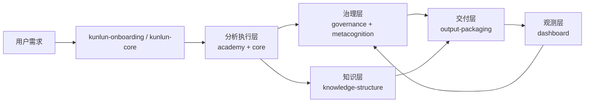

# 昆仑技能生态工程化白皮书（Engineering Whitepaper）

版本：v1.0  
发布日期：2026-05-29  
适用对象：AI Agent 平台架构师、提示工程团队、AI 运营团队、知识工程团队

---

## 1. 执行摘要

昆仑技能生态是一套将“认知方法论”转化为“可安装、可治理、可观测、可持续演进”的工程化系统。  
它的核心价值不在于单一技能能力，而在于形成从冷启动、分析执行、知识沉淀、质量治理、交付封装到系统观测的闭环操作系统。

在本地实例中（`C:\Users\Administrator\Documents\昆仑技能生态`），该生态已形成：
1. 底座能力：`kunlun-core`
2. 方法学习：`kunlun-academy`
3. 流程治理：`kunlun-governance`
4. 知识结构：`kunlun-knowledge-structure`
5. 元认知自检：`kunlun-metacognition`
6. 会话恢复：`kunlun-session-recovery`
7. 输出封装：`kunlun-output-packaging`
8. 可观测性：`kunlun-dashboard`
9. 一键装配：`kunlun-ecosystem`
10. 业务流水线扩展：`kunlun-feishu-pixpark-pipeline`

---

## 2. 系统定位与设计目标

### 2.1 系统定位

昆仑技能生态可视为“认知型 Agent 的工程操作系统层（Cognitive OS Layer）”，位于模型能力之上、业务应用之下。

### 2.2 核心设计目标

1. 把抽象方法论转为可执行流程（可重复、可审计）。
2. 把一次性对话结果转为长期可积累知识资产。
3. 把“会做”提升为“稳定做对”。
4. 把多技能协作变为标准化流水线。
5. 把系统状态透明化（可观测、可回溯、可优化）。

---

## 3. 总体架构



架构上可分为六层：
1. 启动层：冷启动、身份注入、工作区基线建立。
2. 认知执行层：复杂任务分解、多框架推理、桥接策略执行。
3. 治理层：变更分级、审批门控、过程审计。
4. 知识层：信度体系、结构化索引、版本化管理。
5. 交付层：输出检查清单、一致性打包、发布质量控制。
6. 观测层：运行时/知识态/技能态统一可视化。

---

## 4. 技能模块地图（本地已安装）

> 版本基线以 `skills/.skills_store_lock.json`（2026-05-28 安装记录）为准。

| 模块 | 角色 | 本地版本 | 主要职责 |
|---|---|---:|---|
| kunlun-ecosystem | 装配器 | 1.2.0 | 一键安装生态子技能 |
| kunlun-core | 底座 | 1.1.0 | 注入认知基座、身份与记忆骨架 |
| kunlun-academy | 学习层 | 1.4.0 | 方法体系教学与认知能力培养 |
| kunlun-dashboard | 观测层 | 2.6.0 | 7+1 Tab 系统状态仪表盘 |
| kunlun-governance | 治理层 | 1.4.0 | 变更分级、审批、审计与发布门控 |
| kunlun-knowledge-structure | 知识层 | 1.4.0 | T1-T4 信度体系与知识组织规范 |
| kunlun-metacognition | 质控层 | 1.4.0 | 周期性自检、偏差反思、系统心跳 |
| kunlun-onboarding | 引导层 | 1.3.0 | 首次安装冷启动与初始化 |
| kunlun-output-packaging | 交付层 | 2.2.0 | 结果封装与一致性交付检查 |
| kunlun-session-recovery | 连续性层 | 2.4.0 | 新会话认知恢复与上下文续航 |
| kunlun-feishu-pixpark-pipeline | 业务扩展 | 本地扩展 | 飞书需求到图像生产的端到端流程 |

---

## 5. 数据与目录规范

昆仑生态以“文件即状态”的方式构建可追踪系统，核心目录与文件包括：

1. 根目录状态文件：`SOUL.md`、`IDENTITY.md`、`VERSION.md`。
2. 认知数据：`memory-index.md`、`resonance-net.md`、`anti-fragility-pool.md`。
3. 长期存储：`memory/`（analysis、views、change-cards、change-reports 等）。
4. 知识树：`knowledge-tree/`（桥接与学科结构承载）。
5. 技能安装：`skills/` + `.skills_store_lock.json`（安装事实源）。

工程价值：
1. 可 diff（版本对比明确）。
2. 可审计（修改路径可追踪）。
3. 可迁移（环境切换成本低）。

---

## 6. 运行闭环（Operational Loop）

完整运行链路可抽象为：

1. 冷启动：建立身份、基线、目录、初始化标记。
2. 分析执行：按方法论进行任务分解与推理。
3. 治理门控：对关键变更执行分级与审批。
4. 知识沉淀：按信度等级写入结构化索引。
5. 交付封装：检查清单保证输出一致性。
6. 仪表盘快照：固化系统状态并形成反馈。
7. 元认知审查：发现偏差并驱动下一轮优化。

该闭环使系统具有“持续学习 + 持续治理 + 持续观测”能力。

---

## 7. 治理与风险控制

### 7.1 治理机制

1. 分级变更：区分低风险例行更新与高风险结构变更。
2. 权责分离：执行与审批角色分离，降低单点失误风险。
3. 审计留痕：变更卡与变更报告沉淀到文件系统。
4. 发布门控：输出前校验一致性与可追溯性。

### 7.2 典型风险与防护

1. 风险：上下文漂移。  
   防护：`kunlun-session-recovery` + `memory` 索引恢复。
2. 风险：知识污染（未验证信息直接进入高信度层）。  
   防护：`kunlun-knowledge-structure` 的 T1-T4 纪律。
3. 风险：流程失控（边改边跑导致规范漂移）。  
   防护：`kunlun-governance` 分级审批与审计。
4. 风险：状态不可见（团队难判断系统是否健康）。  
   防护：`kunlun-dashboard` 持续快照。

---

## 8. 可观测性与运维

### 8.1 仪表盘观测维度

`kunlun-dashboard` 聚合：
1. 总览
2. 环境/端口
3. Agent
4. 定时任务
5. 技能
6. 流水线
7. Token
8. 昆仑知识态

### 8.2 运维建议

1. 每次深度分析闭环后生成一次 `dashboard.html` 快照。
2. 每周做一次知识信度审计（T3/T4 清理与升级）。
3. 每月做一次治理规则回归（审批链路与门控阈值）。
4. 把关键报告纳入版本发布记录。

---

## 9. 本地实例状态说明（2026-05-29）

基于当前工作区核查：

1. 生态子技能均可读可加载。
2. 2026-05-28 安装后曾出现 ACL 继承异常，现已完成修复。
3. 仪表盘已完成 Windows 兼容性修复（编码、环境采集、Agent 判定）。
4. 当前知识库主文件仍为初始化模板，因此“知识条目/谐波/挑战”指标偏低属数据现状，不是系统故障。

---

## 10. 工程价值评估

### 10.1 优势

1. 架构完整：从方法到执行到治理到观测全链路闭环。
2. 资产化能力强：知识沉淀可持续复用。
3. 团队协作友好：规则显式、职责清晰、结果可追踪。
4. 易扩展：可挂接业务流水线（如飞书 + 图像生产）。

### 10.2 适用场景

1. 高复杂度分析任务（多轮、多源、多步骤）。
2. 对质量稳定性要求高的 AI 生产体系。
3. 需要长期组织记忆与审计合规的团队。

---

## 11. 路线图建议（下一阶段）

1. 指标体系升级：为 dashboard 增加“知识有效覆盖率、回收率、误差纠偏率”。
2. 自动化升级：把 `output-packaging` 与 `dashboard` 串成固定发布流水线。
3. 数据层升级：给 `memory/analysis` 增加结构化元数据（YAML front matter）。
4. 质量层升级：建立“自检失败 -> 治理工单”自动转派机制。
5. 生态层升级：把业务扩展技能统一接入治理与审计协议。

---

## 12. 附录：推荐操作基线

### A. 仪表盘生成

```powershell
python skills/kunlun-dashboard/scripts/generate_dashboard.py
```

### B. 安装事实核对

```powershell
Get-Content skills/.skills_store_lock.json
```

### C. 技能目录健康检查

```powershell
Get-ChildItem skills -Directory | Where-Object { $_.Name -like 'kunlun-*' }
```

---

## 结语

昆仑技能生态的本质，是把“聪明的单次回答”升级为“可治理的长期认知生产系统”。  
当方法、流程、知识、治理、观测形成闭环后，AI 才能从工具进化为可持续的组织能力。
